# MyNoti 아키텍처 온보딩

신입·협업자가 레포를 처음 열었을 때, **알림이 어디서 들어와 어디에 남고 화면에 어떻게 보이는지**를 따라가기 위한 설명서다. 근거는 현재 코드와 `backend/README.md`, `backend/docs.md`다.

---

## 1. 한 줄 소개

MyNoti는 지정한 앱의 알림 원문을 기기에 모은 뒤 LLM으로 분류·요약하고, 중요한 것만 홈·요약·캘린더·리마인더로 보여주는 대학생용 알림 정리 앱이다.

---

## 2. 누가 무엇을 쓰는가

이 부분이 하는 일: 사용자 폰의 타겟 앱이 알림을 띄우면 MyNoti Android가 원문을 보관하고, 분석만 MyNoti Backend가 OpenAI에 대행한다. 백엔드는 알림을 저장하지 않는다.

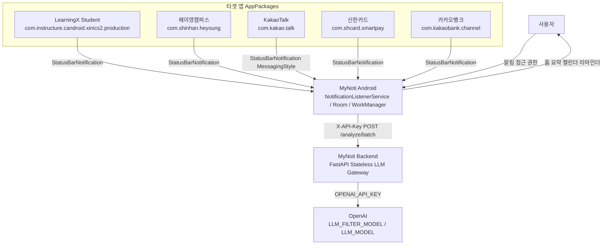

사용자는 MyNoti 앱만 만진다. 카톡·LearningX 같은 타겟 앱은 MyNoti를 호출하지 않고, 안드로이드가 상태바 알림을 `MyNotiNotificationListener`로 가로챈다. MyNoti Backend는 OpenAI 키를 지키는 게이트웨이다. 기본 타겟 5앱 패키지는 `AppPackages`와 `AppSettings.defaultTargetApps`에 있다. 사용자는 설정에서 다른 앱을 추가할 수 있다.

| 등장 시스템 | 역할 | 근거 |
|---|---|---|
| 사용자 | 알림 접근 권한, 타겟 앱 on/off, Highlight/Mute, 리마인더 | `SettingsScreen.kt`, `AndroidManifest.xml` |
| 타겟 앱 5종 | 알림 원문을 발생시킴 | `AppPackages.kt` |
| MyNoti Android | 수집·저장·표시·분석 예약 | `MyNotiNotificationListener.kt`, Room, `AnalyzeNotificationWorker.kt` |
| MyNoti Backend | 분석만 하고 저장하지 않음 | `backend/app/main.py`, `backend/README.md` |
| OpenAI | 1차 필터 boolean + 구조화 JSON | `llm_service.py`, `config.py` |

---

## 3. 전체 구조

이 부분이 하는 일: 데이터가 기기 Room에 머물고, 서버는 요청 순간만 LLM을 부른다. 키도 역할이 갈린다.

### 시스템 구성

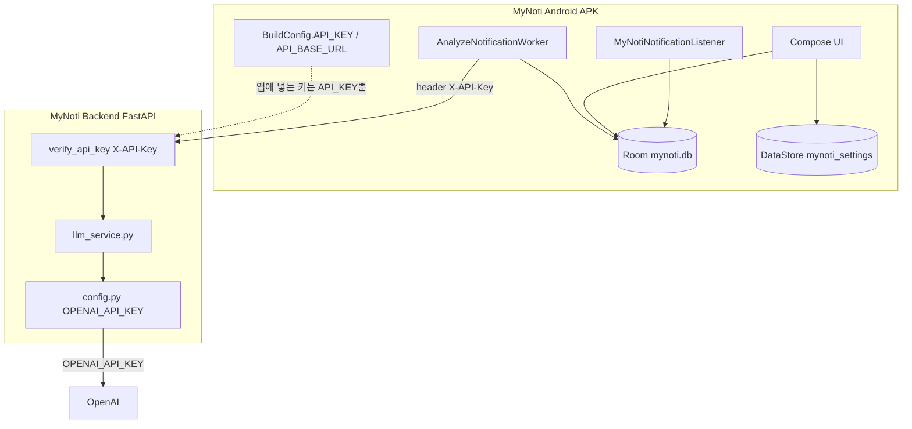

Android는 `BuildConfig.API_KEY`를 `NetworkModule`이 `X-API-Key`로 붙인다. OpenAI 키는 `backend/app/config.py`의 `OPENAI_API_KEY`에만 있다. `app/build.gradle.kts`는 `API_KEY`와 `API_BASE_URL`만 BuildConfig에 넣는다. 백엔드 프로세스에는 DB가 없다.

### 안드로이드 레이어

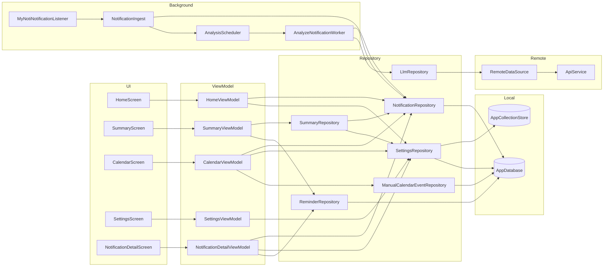

화면은 ViewModel만 보고, ViewModel은 Repository 인터페이스만 본다. 구현체는 `AppContainer`가 조립한다. HTTP는 `LlmRepository` → `RemoteDataSource` → `ApiService` 한 줄이고, Listener는 이 줄을 타지 않는다.

조립 위치:

```kotlin
class AppContainer(context: Context)
```

파일: `app/src/main/java/org/eos/mynoti/di/AppContainer.kt`

### 설계 원칙

- 백엔드에 DB가 없다. 알림 원문·분석 결과는 서버에 남기지 않는다 (`backend/README.md`, `main.py` 주석).
- `MyNotiNotificationListener`는 API를 직접 호출하지 않는다. Room insert 후 `AnalysisScheduler`만 예약한다.
- OpenAI 키는 서버 `.env` / `config.py`에만 있다. 앱은 `X-API-Key`만 쓴다.
- 사용자 알림 데이터의 Source of Truth는 Room `mynoti.db`다.
- Highlight/Mute 키워드 규칙은 안드로이드 `keyword_rules`와 `NotificationRules.kt`에서만 적용한다. 백엔드는 키워드를 요청으로 받지 않는다.

---

## 4. 알림이 앱에 들어오는 길

이 부분이 하는 일: 상태바 알림을 파싱해 타겟 앱이면 Room에 원문을 `PENDING`으로 넣고, WorkManager가 나중에 분석을 붙인다.

### 수신부터 분석 예약까지

1. `MyNotiNotificationListener.onNotificationPosted`가 `StatusBarNotification`을 받는다.
2. 자기 패키지(`packageName == MyNoti`)는 버린다.
3. `PostedNotificationParser.parse`가 일반 extras 또는 MessagingStyle(카톡)을 읽는다. 그룹 요약·통화 알림은 버린다.
4. 같은 notification key의 fingerprint가 같으면 중복으로 스킵한다. 카톡은 마지막 메시지 fingerprint로 새 말만 고른다 (`ConversationNotificationFormatter`).
5. `settings.enabledPackageNames`에 없으면 저장하지 않는다.
6. `NotificationIngest.insertAndEnqueue`가 `AnalysisStatus.PENDING`으로 insert한 뒤 `AnalysisScheduler.enqueue`를 호출한다.

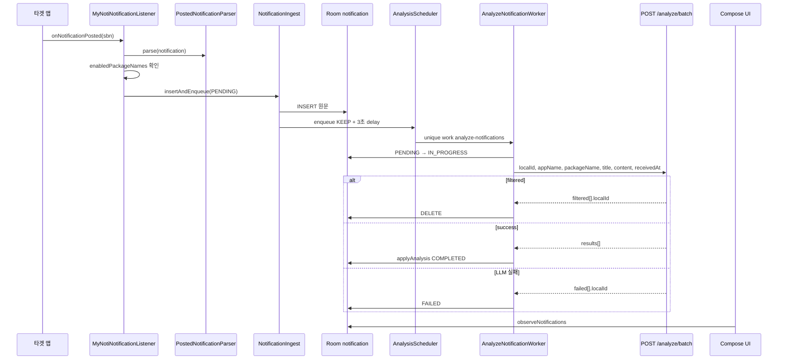

Listener에서 API로 가는 화살표는 없다. Worker만 `DefaultLlmRepository.analyzeBatch`를 부른다. `ApiService.analyze`(단건)는 구현되어 있으나 Worker는 쓰지 않는다. `enqueue`는 `ExistingWorkPolicy.KEEP`이라 이미 도는 작업을 교체하지 않는다. 같은 unique work가 없으면 3초 뒤에 시작한다. `AppContainer`는 15분 `enqueuePeriodic`도 걸어 둔다.

### AnalysisStatus

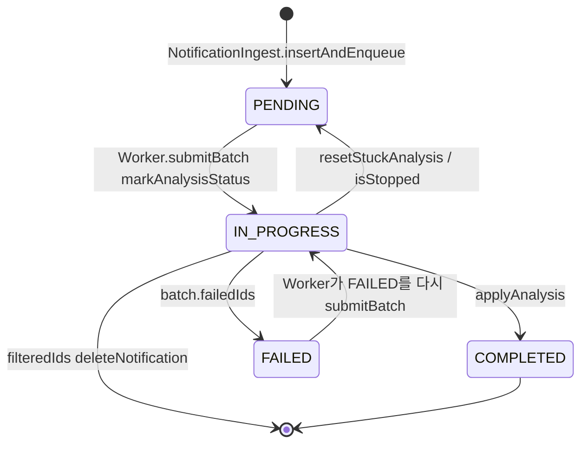

`PENDING`은 “원문만 있고 아직 LLM 결과가 없다”는 뜻이다. `IN_PROGRESS`는 이번 batch에 실려 서버로 간 상태다. 성공하면 `COMPLETED`로 제목·요약·타입·기한이 덮인다. 서버가 `failed`로 돌려주면 `FAILED`로 남고, Worker 루프가 다시 집어 올린다. 작업이 중간에 멈추면 `resetStuckAnalysis`가 `IN_PROGRESS`를 `PENDING`으로 되돌린다. 1차 필터에 걸린 알림은 상태가 아니라 **행 삭제**다.

관련 시그니처:

```kotlin
suspend fun insertAndEnqueue(notification: Notification): Long
```

`NotificationIngest.kt`

```kotlin
fun enqueue(context: Context)  // KEEP, initialDelay 3s
fun enqueuePeriodic(context: Context)  // 15분, KEEP
```

`AnalyzeNotificationWorker.kt` 안의 `AnalysisScheduler`

---

## 5. 백엔드가 알림을 분석하는 길

이 부분이 하는 일: 앱이 보낸 원문 1건(또는 최대 20건)을 읽고, 잡담이면 본 분석을 건너뛰고, 아니면 JSON 분석 결과만 돌려준다. 서버 디스크에는 아무것도 안 남긴다.

### 엔드포인트

| 메서드 | 경로 | 인증 | 누가 부르나 |
|---|---|---|---|
| POST | `/api/v1/notifications/analyze` | `X-API-Key` | `ApiService.analyze` (Worker 미사용) |
| POST | `/api/v1/notifications/analyze/batch` | `X-API-Key` | `AnalyzeNotificationWorker` → `analyzeBatch` |
| GET | `/api/v1/health` | 없음 | 헬스 체크 |

요청/응답 필드는 camelCase다 (`backend/docs.md`, `models.py`). `type`은 `CLASS` \| `ASSIGNMENT` \| `COMMUNICATION` \| `FINANCIAL` \| `ETC`이고 Android `NotificationType`과 같다.

### 파이프라인

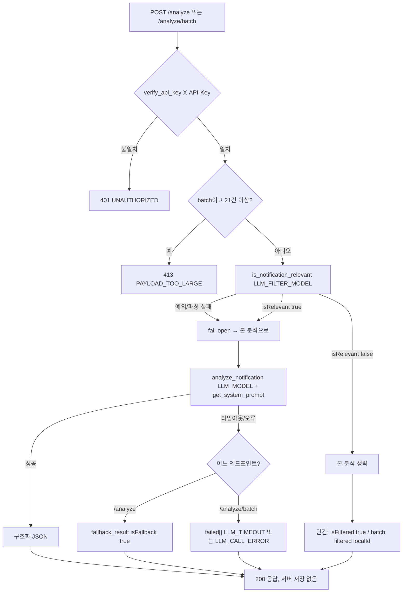

인증은 `auth.py`의 `verify_api_key`가 헤더와 `settings.API_KEY`를 비교한다. 필터 모델은 `isRelevant` boolean만 받는다. 필터 호출이 실패하면 **통과**시킨다 (`llm_service.py` fail-open). 본 분석 프롬프트는 `get_system_prompt(package_name, app_name)`이 고른다. 기본 5앱은 `_PACKAGE_EXACT_MAP`으로 패키지 문자열이 일치할 때만 분기하고, 그다음에 `_PACKAGE_KEYWORD_MAP` 부분 문자열을 본다. 예: `com.kakaobank.channel` → `FINANCIAL_ADDON`, `com.kakao.talk` → `KAKAOTALK_ADDON`.

단건 `/analyze`에서 LLM이 죽으면 `fallback_result`로 200을 준다. batch에서는 폴백 JSON을 만들지 않고 그 `localId`만 `failed`에 넣는다.

### `/analyze` vs `/analyze/batch`의 필터 표현

**단건 `/analyze`**: 필터되면 본문 필드는 빈 값이고 `isFiltered: true`다. `backend/docs.md`는 안드로이드가 `isFiltered`를 먼저 보고 true면 나머지 필드를 쓰지 말고 버리라고 한다. 매퍼는 `AnalyzeNotificationResponse.toAnalysisOrNull`에서 null을 반환한다.

**batch `/analyze/batch`**: 필터된 건은 `results`에 없고 `filtered: [{ "localId": 102 }]`에만 있다. 분석 필드는 없다. Worker는 `filteredIds`에 대해 `deleteNotification`을 호출한다.

프로덕션 수집 경로는 batch다.

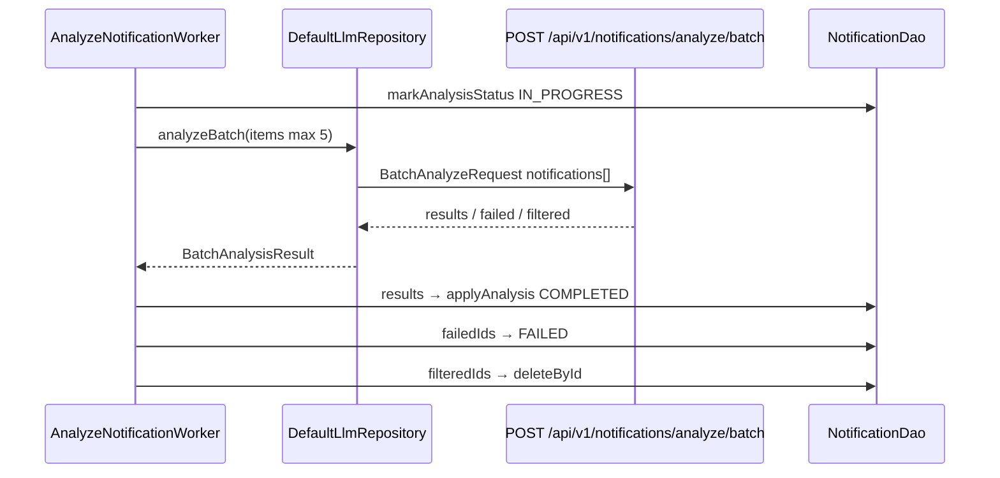

Android는 한 번에 최대 5건(`BATCH_LIMIT`)을 보낸다. 서버 한도는 20건이다. `localId`는 Room `notification_id`다. 매퍼는 `filtered`에 있는 id를 `results`/`failed`에서 빼서 한 id가 두 바구니에 안 남게 한다 (`AnalysisMapper.kt`).

`actionRequired`와 `isFallback`은 domain `NotificationAnalysis`까지는 오지만 Room 컬럼은 없다. batch 성공 항목의 `isFallback`은 서버가 항상 `false`로 넣는다.

---

## 6. 데이터가 어디에 남는지

이 부분이 하는 일: 알림·키워드·리마인더·수동 일정은 SQLite Room에, 타겟 앱 목록과 테마는 DataStore에 둔다.

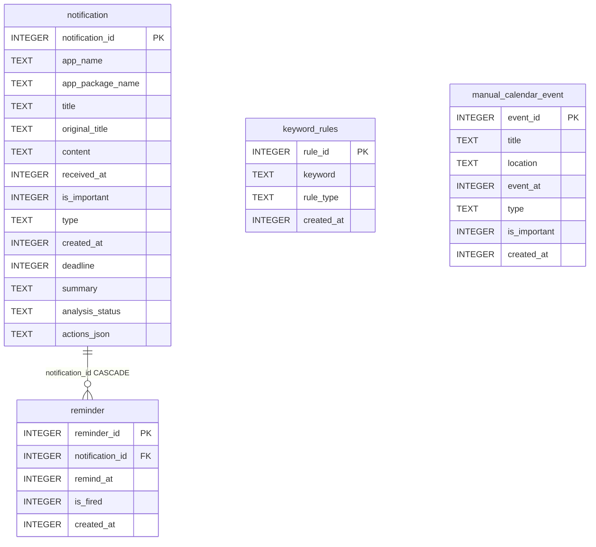

Room 파일 이름은 `mynoti.db`, 스키마 버전은 6이다 (`AppDatabase.kt`). `keyword_rules`는 알림과 FK가 없다. UNIQUE(`keyword`, `rule_type`)라 같은 단어를 Highlight와 Mute에 각각 둘 수는 있다. `reminder`는 알림이 지워지면 CASCADE로 같이 지워진다. `manual_calendar_event`는 알림과 연결되지 않는다.

| 테이블 | 화면이 쓰는 방식 |
|---|---|
| `notification` | 홈 목록, 상세, 요약 집계, 캘린더의 `deadline` 있는 행 |
| `keyword_rules` | 설정 Highlight/Mute, 목록 필터·중요 배지 계산 |
| `reminder` | 상세 리마인더 섹션, 요약 화면 리마인더 그룹 |
| `manual_calendar_event` | 캘린더에 사용자가 추가한 일정 |

**DataStore vs Room**

`AppCollectionStore` (`mynoti_settings`)는 `target_app_packages`(목록에 올라간 패키지), `target_apps`(켜진 패키지), `THEME_PREFERENCE`를 저장한다. 알림 원문은 여기 없다. `DefaultSettingsRepository`가 DataStore의 앱/테마와 Room `keyword_rules`를 합쳐 `AppSettings` Flow를 만든다.

`original_title`은 LLM이 `title`을 덮어쓴 뒤에도 원문 제목을 다시 서버에 보내기 위한 컬럼이다 (`AnalysisMapper.toBatchItem`이 `originalTitle`을 우선 사용).

---

## 7. 중요도와 필터

이 부분이 하는 일: 서버는 “이 알림이 중요해 보이는가”만 말하고, 사용자가 정한 단어로 가리거나 강조하는 일은 앱이 한다.

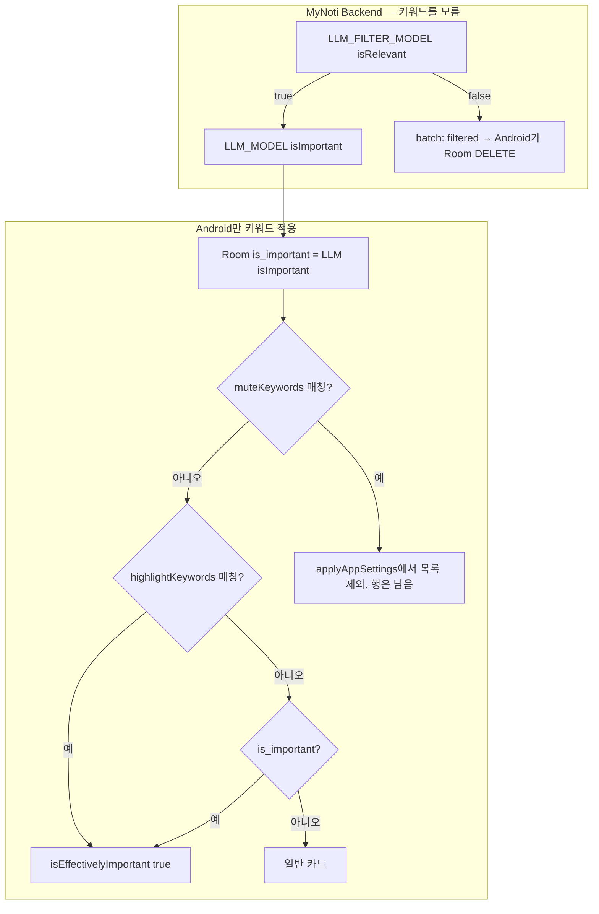

백엔드 요청 DTO에는 키워드 필드가 없다. 필터(`isFiltered` / `filtered`)는 “잡담·광고라 사용자에게 보여 줄 가치가 없다”는 **서버 판단**이고, Mute는 “이 단어가 보이면 목록에서 숨긴다”는 **사용자 규칙**이다. Mute된 알림도 Listener가 저장하고 Worker가 분석할 수 있다. 숨기는 시점은 UI `applyAppSettings`다.

Highlight(`KeywordRuleType.IMPORTANT`)는 Room `is_important`를 덮지 않는다. 표시용 함수가 OR 한다.

```kotlin
fun Notification.isEffectivelyImportant(highlightKeywords: List<String>): Boolean =
    isImportant || matchesAnyKeyword(highlightKeywords)
```

`NotificationRules.kt`

적용 위치:

| 규칙 | 언제 | 효과 |
|---|---|---|
| LLM `isFiltered` / batch `filtered` | Worker가 응답을 받은 직후 | Room에서 삭제. 홈에 안 남음 |
| 타겟 앱 off | Listener 저장 전, 그리고 `applyAppSettings` | 새 알림은 insert 안 함. 이미 있는 행은 목록에서 숨김 |
| Mute | `applyAppSettings` | 목록·요약·캘린더 입력에서 제외. DELETE 아님 |
| LLM `isImportant` | `applyAnalysis`가 컬럼에 저장 | 홈 `importantOnly` 필터는 이 컬럼만 본다 (`NotificationFilter.matches`) |
| Highlight | `isEffectivelyImportant` | 홈 배지, 상세, 캘린더 중요, 요약 `importantCount` |
| 상세 별 토글 | `NotificationDetailViewModel.toggleImportant` | Room `is_important`를 뒤집음. 키워드와 별개 |

키워드 기본값은 `AppSettings.defaultHighlightKeywords` / `defaultMuteKeywords`이고, DB가 비어 있으면 `DatabaseSeeder`가 `keyword_rules`에 넣는다.

---

## 8. 화면이 데이터를 보여주는 방식

이 부분이 하는 일: 하단 4탭이 Room(과 DataStore)을 구독하고, 상세는 딥링크로도 열린다.

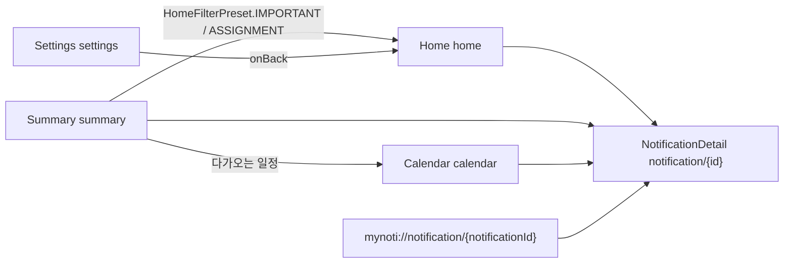

`Routes.kt`의 탑레벨은 `home`, `summary`, `calendar`, `settings`다. 상세는 `notification/{notificationId}`이고 `MyNotiApp.kt`가 `navDeepLink { uriPattern = "mynoti://notification/{notificationId}" }`를 건다. Manifest도 scheme `mynoti`, host `notification`이다. `ReminderNotifier`가 같은 URI로 상세를 연다.

하단바는 `currentRoute in topLevelRoutes`일 때만 보인다. 상세에서는 숨는다.

| 화면 | ViewModel이 구독하는 것 |
|---|---|
| Home | `NotificationRepository.observeNotifications`, `SettingsRepository.settings` → `applyAppSettings` + `applyFilter` |
| Summary | `SummaryRepository.observeDailySummary`, `ReminderRepository.observeVisibleItems` |
| Calendar | `NotificationRepository`, `SettingsRepository`, `ManualCalendarEventRepository.observeEvents` |
| Settings | `SettingsRepository.settings`, `InstalledAppCatalog` (앱 피커) |
| Detail | `observeNotification(id)`, `settings`, `ReminderRepository.observeByNotificationId` |

홈에는 앱·타입·중요 칩 필터가 있다 (`HomeFilterBar`). 제목/본문 검색창은 없다. `searchableText()`는 키워드 매칭용이다.

요약의 “중요/과제” 카드는 `HomeFilterController`에 프리셋을 넣고 홈으로 이동한다. 캘린더의 알림 일정은 `deadline == null`이면 만들지 않는다 (`toCalendarEvent`).

---

## 9. 리마인더와 캘린더

이 부분이 하는 일: 리마인더는 특정 알림에 알람을 걸고, 캘린더는 LLM이 뽑은 기한과 사용자가 찍은 일정을 같은 달력에 겹친다.

### 리마인더

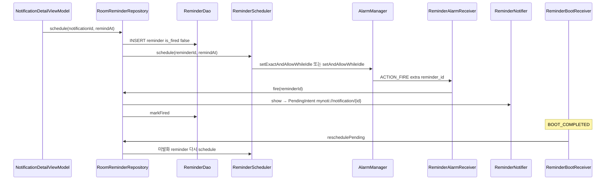

정확 알람을 못 쓰면 `ReminderScheduler`는 inexact로 폴백한다. `POST_NOTIFICATIONS`는 상세에서 리마인더를 만들 때 요청한다. 앱 시작 시 `AppContainer`도 `reschedulePending()`을 한 번 호출한다.

### 자동 기한 vs 수동 일정

| | 자동 (알림 deadline) | 수동 |
|---|---|---|
| 출처 | LLM `deadline` → `notification.deadline` | `manual_calendar_event` |
| 매핑 | `Notification.toCalendarEvent` | `ManualCalendarEventEntity.toCalendarEvent` |
| 식별 | `CalendarEvent.notificationId` | `CalendarEvent.manualEventId` |
| 위치 | 알림 앱 이름 | `AppPackages.MANUAL` |
| 쓰기 API | 분석 결과 UPDATE | `ManualCalendarEventRepository.add`만 있음 |

캘린더 ViewModel은 `applyAppSettings`를 거친 알림 이벤트와 수동 이벤트를 합쳐 `eventAt`으로 정렬한다. 수동 일정의 수정·삭제 Repository 메서드는 없다.

---

## 10. 요약 화면

이 부분이 하는 일: Room에 있는 알림을 설정으로 걸러 숫자와 긴급 3건, 그리고 리마인더 목록을 만든다.

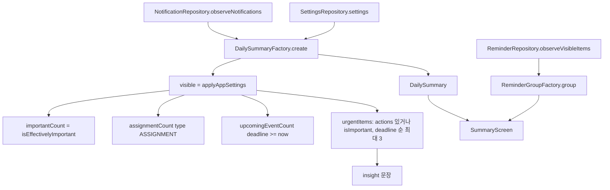

`RoomSummaryRepository`는 알림 Flow와 설정 Flow를 `DailySummaryFactory.create`에 넘긴다. `create`는 `receivedAt`으로 “오늘”을 자르지 않는다. `visible`은 켜진 타겟 앱 + Mute 제외 전체다. `upcomingEventCount`만 `deadline`이 지금 이후인지를 본다. 긴급 3건은 Highlight가 아니라 저장된 `isImportant`와 `actions`를 본다.

요약 UI는 이 `DailySummary` 카드와, 별도로 구독한 리마인더 그룹을 같이 그린다 (`SummaryViewModel`).

---

## 11. 로컬에서 돌려보는 법

이 부분이 하는 일: 백엔드를 띄우고, 앱이 그 주소와 `X-API-Key`로 batch를 치게 한다. 실제 비밀 값은 적지 않는다.

### 백엔드

`backend/README.md` 기준:

```bash
cd backend
python -m venv venv
venv\Scripts\activate
pip install -r requirements.txt
cp .env.example .env
```

`.env`에 채울 항목 (값은 플레이스홀더):

- `OPENAI_API_KEY` — 서버만 사용. 앱에 넣지 않는다.
- `API_KEY` — 앱 `X-API-Key`와 동일해야 한다.
- `LLM_MODEL`, `LLM_FILTER_MODEL` — 사용 가능한 모델 ID.
- `LLM_TIMEOUT_SEC` — 건당 LLM 타임아웃. 예시 기본은 `30.0`.

```bash
uvicorn app.main:app --reload --port 8000
```

Swagger: `http://localhost:8000/docs`. 헬스: `GET /api/v1/health`.

프롬프트 분기 단위 테스트(LLM 없음): `backend/test/test_prompt_routing.py`.

### 안드로이드

프로젝트 루트 `.env.example`을 복사해 `.env`를 만들거나, `backend/.env`의 `API_KEY`를 Gradle이 fallback으로 읽는다 (`app/build.gradle.kts`).

- `API_BASE_URL` — 에뮬레이터는 `http://10.0.2.2:8000/` (`ApiConfig.kt` 주석).
- `API_KEY` — 백엔드와 같은 값.

설정 화면에서 알림 접근(`Settings.ACTION_NOTIFICATION_LISTENER_SETTINGS`)을 켠다. DEBUG 빌드는 DB가 비어 있으면 `DatabaseSeeder`가 목 알림과 기본 키워드를 넣고, 설정에 LearningX 샘플 insert 버튼이 있다.

---

## 12. 용어 사전

| 용어 | 이 레포에서의 뜻 |
|---|---|
| Source of Truth | 사용자 알림·분석 결과의 원본이 Room이라는 원칙. 서버는 저장하지 않는다. |
| `PENDING` | 원문은 Room에 있고 LLM 결과가 아직 없다. |
| `IN_PROGRESS` | 이번 batch에 실려 서버로 보냈다. |
| `COMPLETED` | `applyAnalysis`로 요약/타입/기한이 반영됐다. |
| `FAILED` | batch `failed[]`. Worker가 다시 집어 올린다. |
| `localId` | 요청/응답의 Room `notification_id`. |
| `isFiltered` | 단건 `/analyze`에서 1차 필터에 걸렸다는 플래그. 나머지 필드는 placeholder. |
| `filtered[]` | batch에서 필터된 `localId` 목록. Android는 해당 행을 DELETE한다. |
| `isFallback` | 단건 `/analyze`가 LLM 실패 시 규칙 기반 결과를 줬다는 표시. Room에 안 남긴다. batch 성공 경로에서는 항상 false. |
| `isImportant` | LLM(또는 상세 토글)이 Room에 저장한 중요 플래그. |
| Highlight | `KeywordRuleType.IMPORTANT`. 표시 중요도에 OR. 컬럼을 덮지 않음. |
| Mute | `KeywordRuleType.MUTE`. 목록에서 숨김. 서버 필터와 다름. |
| `isEffectivelyImportant` | `isImportant \|\| Highlight 매칭`. |
| `enabledPackageNames` | DataStore에서 켜진 타겟 앱. Listener 저장 조건. |
| `deadline` | LLM이 뽑은 기한. 캘린더 자동 일정. |
| `original_title` | LLM이 제목을 바꿔도 다음 요청에 원문 제목을 보내기 위한 컬럼. |
| `X-API-Key` | 앱↔백엔드 공유 비밀. OpenAI 키가 아니다. |
| `LLM_FILTER_MODEL` | 1차 `isRelevant` 전용 모델. fail-open. |
| `LLM_MODEL` | 본 분석 Structured Output 모델. |
| fail-open | 필터 호출이 실패하면 본 분석으로 보낸다. 중요한 알림을 숨기지 않기 위함. |
| Stateless LLM Gateway | DB 없이 OpenAI 호출만 대행하는 FastAPI (`backend/README.md`). |

관련 문서: `backend/README.md`, `backend/docs.md`. 루트 `README.md`는 제목만 있다.
